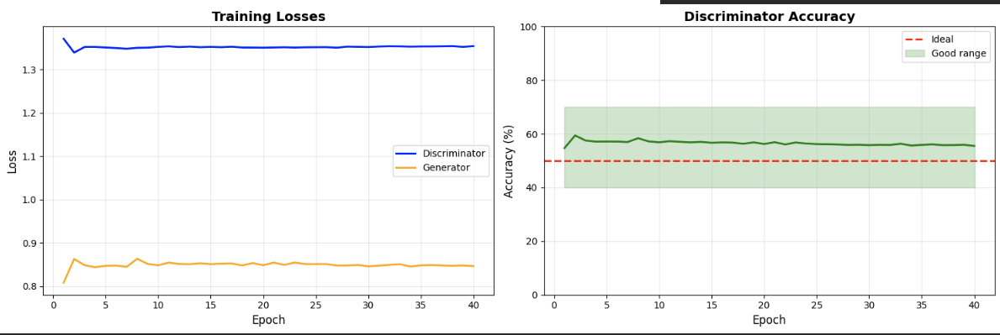
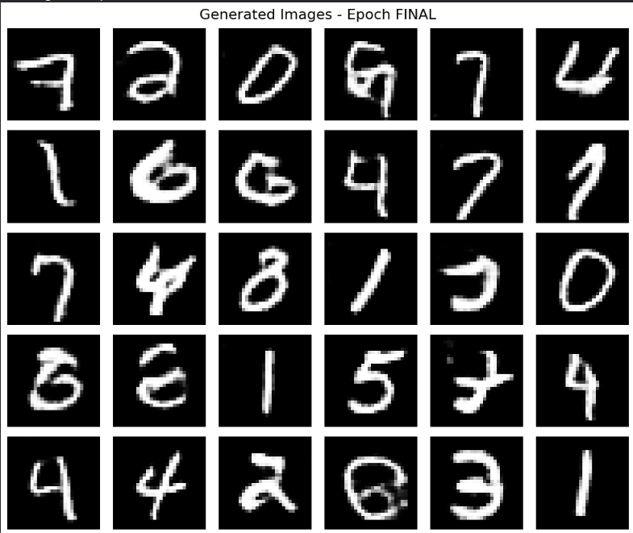

# Stable DCGAN for MNIST Digit Generation


A robust implementation of Deep Convolutional Generative Adversarial Network (DCGAN) for generating handwritten digits using the MNIST dataset. This implementation uses TensorFlow's GradientTape API for stable and efficient training.

## 🎯 Features

- **Modern TensorFlow Implementation**: Uses `@tf.function` and GradientTape for optimal performance
- **Stable Training**: Incorporates multiple stabilization techniques including:
  - Label smoothing (0.9 for real images)
  - Dropout regularization in discriminator
  - Proper batch normalization
  - Balanced learning rates
- **Real-time Monitoring**: Tracks discriminator accuracy to ensure balanced training
- **Progressive Image Generation**: Visualizes improvements every 5 epochs

## 📊 Results

## Plot History



### Final Performance Metrics
- **Discriminator Loss**: 1.3537
- **Generator Loss**: 0.8464
- **Discriminator Accuracy**: 55.5%

The discriminator accuracy remaining in the 40-70% range throughout training indicates **balanced and healthy GAN training** - neither the generator nor discriminator is dominating.

### Final Sample




### Training Progress
```
✅ Epoch 1-10:   Basic shapes and patterns emerge
✅ Epoch 11-25:  Clear digit structures form
✅ Epoch 26-40:  Sharp, high-quality digit generation
```

## 🏗️ Architecture

### Generator Architecture
```
Input: Latent vector (100 dimensions)
├── Dense Layer (7×7×256) + BatchNorm + LeakyReLU
├── Reshape to (7, 7, 256)
├── Conv2DTranspose (14×14×128) + BatchNorm + LeakyReLU
├── Conv2DTranspose (28×28×64) + BatchNorm + LeakyReLU
└── Conv2D Output (28×28×1) with Tanh activation

Total Parameters: 2,330,944 (8.89 MB)
Trainable: 2,305,472 (8.79 MB)
```

### Discriminator Architecture
```
Input: Image (28×28×1)
├── Conv2D (14×14×64) + LeakyReLU + Dropout(0.3)
├── Conv2D (7×7×128) + LeakyReLU + Dropout(0.3)
├── Flatten
└── Dense(1) with Sigmoid activation

Total Parameters: 212,865 (831.50 KB)
```

## 🚀 Installation

### Requirements
```bash
pip install numpy matplotlib tensorflow
```

### Clone and Run
```bash
git clone <repository-url>
cd dcgan-mnist
python dcgan_mnist.py
```

## 💻 Usage

### Basic Training
```python
from dcgan_mnist import StableDCGAN

# Initialize the GAN
gan = StableDCGAN()

# Train for 40 epochs
history = gan.train(epochs=40, batch_size=128)

# Generate images
gan.generate_images(epoch='FINAL', n=36)

# Plot training history
gan.plot_history(history)
```

### Configuration
Modify hyperparameters at the top of the script:
```python
LATENT_DIM = 100      # Dimension of latent space
BATCH_SIZE = 128      # Training batch size
EPOCHS = 40           # Number of training epochs
IMG_SHAPE = (28, 28, 1)  # MNIST image shape
```

## 🎨 Key Techniques

### 1. **Label Smoothing**
Real labels are set to 0.9 instead of 1.0 to prevent discriminator overconfidence:
```python
d_loss_real = cross_entropy(tf.ones_like(real_output) * 0.9, real_output)
```

### 2. **Dropout Regularization**
30% dropout in discriminator prevents overfitting:
```python
model.add(Dropout(0.3))
```

### 3. **Proper Upsampling**
Uses `Conv2DTranspose` for learned upsampling instead of simple resizing:
```python
Conv2DTranspose(128, kernel_size=5, strides=2, padding='same')
```

### 4. **Batch Normalization**
Applied after convolutional layers (except output) for training stability:
```python
model.add(BatchNormalization())
```

### 5. **LeakyReLU Activation**
Prevents dying ReLU problem with negative slope of 0.2:
```python
model.add(LeakyReLU(negative_slope=0.2))
```

## 📈 Training Insights

### Discriminator Accuracy Interpretation
- **< 30%**: Generator is too strong, discriminator needs help
- **40-70%**: ✅ **Ideal balanced training**
- **> 80%**: Discriminator is too strong, generator may fail to learn

### Loss Convergence
Both losses should stabilize around similar values, indicating equilibrium:
- D_loss: ~1.35
- G_loss: ~0.85

## 🔍 Monitoring Training

The implementation provides real-time feedback:
```
Epoch 40/40 | Batch 400 | D_loss: 1.3530 | D_acc: 60.5% | G_loss: 0.7999

======================================================================
EPOCH 40 SUMMARY
D_loss: 1.3537 | D_acc: 55.5% | G_loss: 0.8464
✅ Training balanced!
======================================================================
```

## 📁 Project Structure
```
.
├── dcgan_mnist.py          # Main implementation
├── README.md               # This file
└── outputs/                # Generated images (created during training)
```

## 🎓 Learning Resources

### Understanding GANs
- Original GAN paper: [Goodfellow et al., 2014](https://arxiv.org/abs/1406.2661)
- DCGAN paper: [Radford et al., 2015](https://arxiv.org/abs/1511.06434)

### Key Concepts
- **Adversarial Training**: Generator and discriminator compete in a minimax game
- **Mode Collapse**: When generator produces limited variety (prevented by our techniques)
- **Training Instability**: Common in GANs, addressed through multiple stabilization methods

## 🛠️ Troubleshooting

### Generator Dominating (D_acc < 30%)
- Increase discriminator learning rate
- Add more dropout to generator
- Train discriminator more iterations per generator step

### Discriminator Dominating (D_acc > 80%)
- Decrease discriminator learning rate
- Reduce dropout in discriminator
- Increase label smoothing

### Mode Collapse
- Decrease learning rates
- Add noise to discriminator inputs
- Use different optimizer settings

## 📝 License

This project is licensed under the MIT License - see the LICENSE file for details.

## 🤝 Contributing

Contributions are welcome! Please feel free to submit a Pull Request.

## 🙏 Acknowledgments

- MNIST dataset from Yann LeCun's website
- TensorFlow team for excellent documentation
- DCGAN architecture inspired by Radford et al.

## 📧 Contact

For questions or feedback, please open an issue on GitHub.

---

**Happy Generating! 🎨✨**